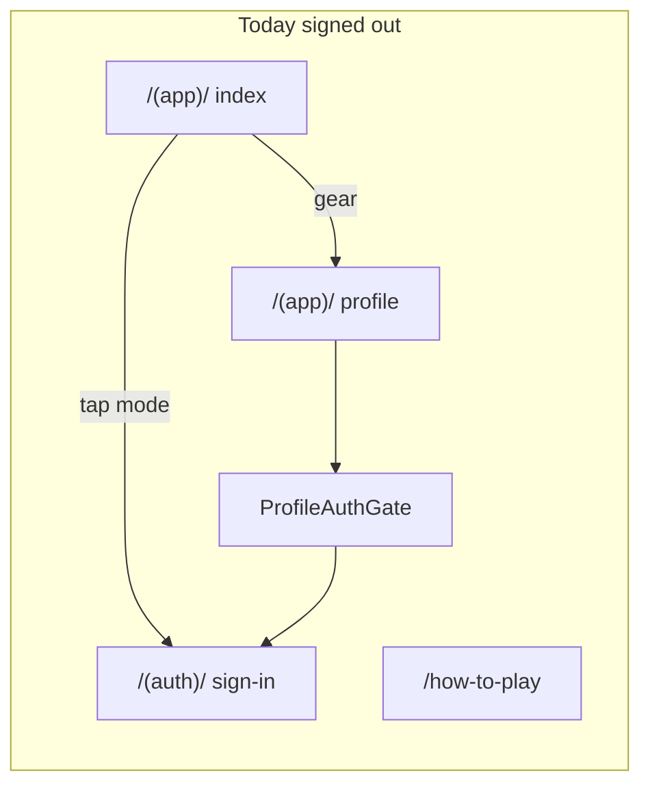

# Add visible auth on public-facing screens

## Current behavior (relevant files)

- **Routing:** Root [`app/_layout.tsx`](app/_layout.tsx) registers `how-to-play`, `(auth)`, `(app)`, etc. [`app/index.tsx`](app/index.tsx) immediately `<Redirect href="/(app)/" />` — there is no standalone marketing landing; “public” in practice means **root stack siblings** like [`app/how-to-play.tsx`](app/how-to-play.tsx) plus the **default hub** [`app/(app)/index.tsx`](app/(app)/index.tsx).
- **Sign-in routes:** [`app/(auth)/sign-in.tsx`](app/(auth)/sign-in.tsx) and [`app/(auth)/sign-up.tsx`](app/(auth)/sign-up.tsx) already implement Clerk OAuth via [`lib/hooks/useClerkOAuthFlow.ts`](lib/hooks/useClerkOAuthFlow.ts).
- **Why it feels hidden:** On the hub, [`app/(app)/index.tsx`](app/(app)/index.tsx) only sends users to `/(auth)/sign-in` when they **pick a mode** while signed out (`onSelectMode`); the header only shows token chip + settings (`router.push('/(app)/profile')`). [`app/how-to-play.tsx`](app/how-to-play.tsx) has **no** sign-in affordance. [`components/ProfileAuthGate.tsx`](components/ProfileAuthGate.tsx) already has primary/secondary CTAs to sign-up/sign-in, but that requires discovering the settings gear first.
- **Dev gotcha:** [`lib/authMode.ts`](lib/authMode.ts) sets `isAuthDisabled()` to `true` in `__DEV__` unless `EXPO_PUBLIC_DISABLE_AUTH=false`. [`app/(auth)/_layout.tsx`](app/(auth)/_layout.tsx) redirects to `/(app)/` when `authDisabled`, so **any new “Sign in” link will bounce back to the hub in default dev** until that env flag is set. Worth a one-line comment near new CTAs or in README only if you touch docs (optional).

## Recommended implementation

### 1. Small reusable UI helper (single place for behavior)

Add a focused component (e.g. `components/PublicAuthEntry.tsx` or `SignedOutAuthLinks.tsx`) that:

- Uses `useAuth()` from `@clerk/clerk-expo` and `isAuthDisabled()` from [`lib/authMode.ts`](lib/authMode.ts).
- Renders **nothing** when `authDisabled`, `!isLoaded`, or `isSignedIn`.
- Otherwise renders compact actions: **Sign in** → `router.push('/(auth)/sign-in')`, **Create account** (optional second control) → `/(auth)/sign-up`, using existing copy keys such as [`auth.signUp.signIn`](lib/i18n/messages/en.ts) and [`profile.guest.createAccount`](lib/i18n/messages/en.ts) (or add `common.signIn` / `common.createAccount` if you want tone consistent outside the guest card).

This keeps [`app/(app)/index.tsx`](app/(app)/index.tsx) and [`app/how-to-play.tsx`](app/how-to-play.tsx) thin and avoids duplicating `authDisabled` logic.

### 2. Home hub header

In [`app/(app)/index.tsx`](app/(app)/index.tsx), extend the `GameHeader` `rightSlot` (or add a narrow row under the header on web only if space is tight):

- When signed out and auth enabled: show the new component **next to** the existing settings `Pressable` (e.g. horizontal `View` with gap), so preferences remain one tap away while **Sign in** is visible without opening profile.
- Preserve current layout for signed-in users and for `authDisabled`.

Match existing patterns: `Pressable` from `@/components/ui/Pressable`, [`useI18n`](lib/i18n/useI18n.ts), [`HOME_SOFT_UI`](themes) or hub styles for colors.

### 3. How-to-play screen

In [`app/how-to-play.tsx`](app/how-to-play.tsx):

- Import the same helper.
- In the top bar beside the back pill (e.g. `flexDirection: 'row'`, `justifyContent: 'space-between'`, `width: '100%'` with `minWidth: 0`), render the signed-out auth actions on the trailing side for LTR (mirror for RTL using existing [`getRowDirection`](lib/i18n/direction.ts) patterns like other screens).

### 4. Tests and verification

- Extend [`__tests__/app/home.test.tsx`](__tests__/app/home.test.tsx): when `isSignedIn: false` and auth not disabled, assert a **Sign in** control is present (testID on the new component).
- Add a small test file for `how-to-play` or a lightweight render test of the new component in isolation if full screen tests are heavy.

**Verification (you run):** With `EXPO_PUBLIC_DISABLE_AUTH=false` in `.env.local`, open hub and `/how-to-play` on web, tap Sign in, confirm Clerk UI loads. With default dev auth disabled, confirm CTAs are hidden **or** document that sign-in testing requires the env flag (product choice: hide CTAs when `authDisabled` vs show them knowing navigation will redirect — the helper should match the chosen rule).

## Out of scope (unless you want it)

- Restructuring to `app/(public)/` from the product plan doc — not required to surface sign-in.
- Changing `(auth)/_layout` dev redirect semantics — larger behavior change; documenting `EXPO_PUBLIC_DISABLE_AUTH` is usually enough.
