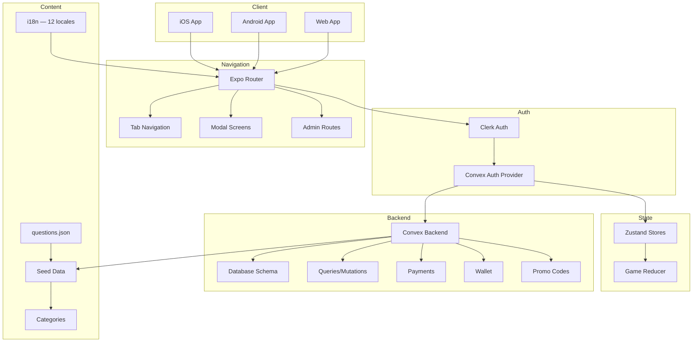
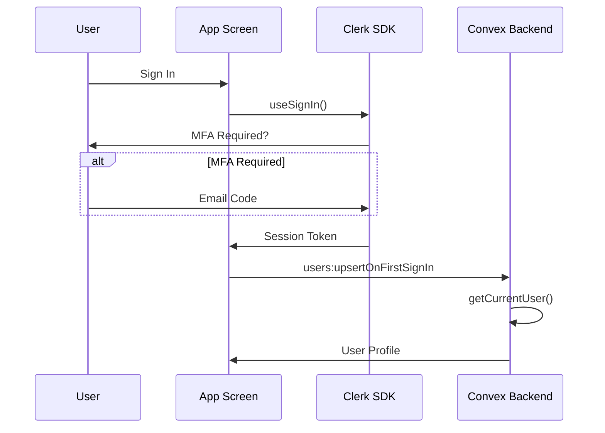
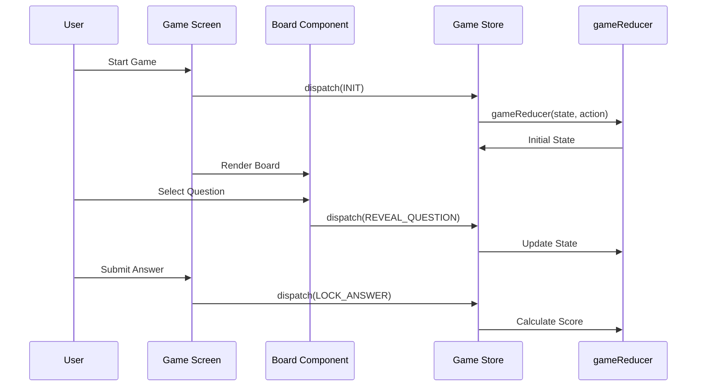

# Codebase Map — Backfire

> Auto-generated by Cartographer. Last mapped: 2026-05-06

## System Overview

Backfire is a competitive multiplayer trivia mobile app built with **Expo SDK 55** (React Native 0.83, React 19.2). Uses Expo Router for navigation, **Clerk** for auth, **Convex** for backend/data, **Zustand** for ephemeral UI state, and TypeScript throughout.



---

## Project Structure

```
.
├── app/                          # Expo Router screens
│   ├── _layout.tsx               # Root: fonts, splash, providers
│   ├── index.tsx                 # Entry redirect → Play tab
│   ├── +html.tsx                 # Web HTML wrapper
│   ├── how-to-play.tsx           # Full-screen instructions
│   ├── (auth)/                   # Auth route group
│   │   ├── _layout.tsx           # Redirect if signed in
│   │   ├── sign-in.tsx           # Login with MFA
│   │   ├── sign-up.tsx           # Registration
│   │   └── forgot-password.tsx   # Password reset (TODO)
│   ├── (app)/                    # Main app route group
│   │   ├── _layout.tsx           # Stack + modals
│   │   ├── index.tsx             # App hub (home)
│   │   ├── profile.tsx           # User profile
│   │   ├── store.tsx             # Token store
│   │   ├── create-game.tsx       # Multi-step game wizard
│   │   ├── game.tsx              # Active gameplay (landscape)
│   │   ├── lobby-settings.tsx    # Lobby config modal
│   │   ├── rules.tsx             # Rules reference modal
│   │   ├── game-recap.tsx        # Post-game summary modal
│   │   ├── theme-picker.tsx      # Theme selector modal
│   │   ├── language-picker.tsx   # UI language picker
│   │   ├── content-languages-picker.tsx  # Content language picker
│   │   └── play/                 # Play flow (10 screens)
│   │       ├── _layout.tsx       # Play stack layout
│   │       ├── index.tsx         # Play entry redirect
│   │       ├── mode.tsx          # Game mode selection
│   │       ├── quick-length.tsx  # Quick play length
│   │       ├── categories.tsx    # Category selection
│   │       ├── team-setup.tsx    # Team configuration
│   │       ├── board.tsx         # Game board
│   │       ├── question.tsx      # Question display
│   │       ├── answer.tsx        # Answer reveal
│   │       └── end.tsx           # Game end screen
│   ├── (admin)/                  # Admin route group (auth-gated)
│   │   ├── _layout.tsx           # Admin layout
│   │   ├── index.tsx             # Admin dashboard
│   │   ├── promo-codes.tsx       # Promo code management
│   │   ├── promo-codes/          # Nested admin routes
│   │   ├── wallets.tsx           # Wallet management
│   │   └── wallets/              # Nested wallet routes
│   └── admin/                    # Admin public routes
│       ├── index.tsx             # Admin entry
│       ├── sign-in.tsx           # Admin sign-in
│       ├── promo-codes.tsx       # Promo code list
│       ├── promo-codes/          # Nested promo routes
│       ├── wallets.tsx           # Wallet list
│       └── wallets/              # Nested wallet routes
│
├── components/                   # Reusable UI components
│   ├── ErrorBoundary.tsx         # Error boundary (class-based)
│   ├── HeroSection.tsx           # Hero banner section
│   ├── HubActionCard.tsx         # Hub action card
│   ├── HubTokenChip.tsx          # Token display chip
│   ├── OAuthProviderButtons.tsx  # OAuth sign-in buttons
│   ├── PillCollapsibleSection.tsx # Collapsible pill section
│   ├── ProfileAuthGate.tsx       # Auth gate for profile
│   ├── BackfireTitleLogo.tsx    # Title logo component
│   ├── ScreenContent.tsx         # Screen content wrapper
│   └── ui/
│       ├── Button.tsx            # Reusable button (5 variants)
│       └── Pressable.tsx         # Base pressable component
│
├── constants/                    # Design tokens and data
│   ├── index.ts                  # Barrel exports
│   ├── theme.ts                  # Design tokens (PALETTES, COLORS)
│   ├── legacy.ts                 # Backward compat constants
│   ├── categories.ts             # Fallback categories
│   ├── categoryPictures.ts       # Category picture assets
│   ├── featureFlags.ts           # Feature flag toggles
│   └── questions.json            # 17,000+ line question DB
│
├── convex/                       # Backend (Convex)
│   ├── _generated/               # Convex-generated types
│   ├── schema.ts                 # Database tables and indexes
│   ├── auth.config.ts            # Clerk JWT issuer config
│   ├── seed.ts                   # Internal seed mutations
│   ├── seed/                     # Normalized seed data
│   ├── users.ts                  # User queries/mutations
│   ├── content.ts                # Category/question queries
│   ├── sessions.ts               # Game session management
│   ├── devices.ts                # Device registration
│   ├── http.ts                   # HTTP endpoints (webhooks)
│   ├── admin.ts                  # Admin queries/mutations
│   ├── payments.ts               # Payment processing
│   ├── promo.ts                  # Promo code logic
│   ├── wallet.ts                 # Wallet operations
│   └── lib/
│       ├── auth.ts               # getCurrentUser, requireUser
│       ├── adminValidation.ts    # Admin input validation
│       ├── contentRules.ts       # Content filtering rules
│       ├── ensureWallet.ts       # Wallet initialization
│       ├── paymentCatalog.ts     # Payment product catalog
│       ├── paymentWebhook.ts     # Webhook handlers
│       ├── promoRules.ts         # Promo code rules
│       ├── purchaserAccounts.ts  # Purchaser account logic
│       └── walletLedger.ts       # Wallet ledger operations
│
├── features/                     # Feature-first folders
│   ├── shared/
│   │   └── types.ts              # GameMode, GameConfig, QuestionCard, etc.
│   ├── gameplay/                 # Game engine
│   │   ├── reducer.ts            # Game state machine
│   │   ├── Board.tsx             # Game board UI
│   │   └── index.ts              # Public exports
│   ├── lobby/                    # Game setup UI
│   │   ├── lifelines.ts          # Lifeline definitions
│   │   ├── LobbyBuilder.tsx      # Lobby UI
│   │   ├── StepCategories.tsx    # Category selection
│   │   ├── StepSplitTeams.tsx    # Player distribution
│   │   ├── StepTeamInfo.tsx      # Team naming/lifelines
│   │   ├── CategoryCard.tsx      # Category card component
│   │   └── index.ts              # Public exports
│   ├── play/                     # Play flow feature
│   │   ├── data.ts               # Play data helpers
│   │   ├── rumble.ts             # Rumble mode logic
│   │   ├── tokenCosts.ts         # Token cost definitions
│   │   ├── storeBundles.ts       # Store bundle definitions
│   │   ├── categoryTopicIcon.ts  # Category → icon mapping
│   │   ├── components/           # Play-specific components (8 files)
│   │   └── styles/               # Play-specific styles
│   ├── auth/                     # Auth feature (barrel)
│   ├── content/                  # Content feature (barrel)
│   ├── profile/                  # Profile feature (barrel)
│   ├── settings/                 # Settings feature (barrel)
│   ├── wallet/                   # Wallet feature (barrel)
│   └── promo/                    # Promo feature (barrel)
│
├── lib/                          # Shared utilities
│   ├── providers.tsx             # Clerk + Convex + SafeArea providers
│   ├── authMode.ts               # Auth mode helpers
│   ├── haptics.ts                # Haptic feedback
│   ├── deviceInstallation.ts     # Device installation tracking
│   ├── deviceInstallationLogic.ts # Device installation logic
│   ├── hooks/
│   │   ├── useTheme.ts           # Theme consumption/hydration
│   │   ├── useNotifications.ts   # Push notifications
│   │   ├── useClerkOAuthFlow.ts  # Clerk OAuth flow
│   │   └── useHubPillLayout.ts   # Hub pill layout
│   ├── i18n/                     # Internationalization
│   │   ├── config.ts             # i18n configuration
│   │   ├── direction.ts          # RTL/LTR handling
│   │   ├── format.ts             # Date/number formatting
│   │   ├── LocaleProvider.tsx    # Locale context provider
│   │   ├── useI18n.ts            # i18n hook
│   │   └── messages/             # Translation catalogs (12 locales)
│   └── navigation/
│       └── landscapeStack.ts     # Landscape navigation helper
│
├── store/                        # Zustand stores
│   ├── auth.ts                   # Auth store
│   ├── game.ts                   # Game session store
│   ├── play.ts                   # Primary play/session store
│   ├── theme.ts                  # Theme preference store
│   ├── locale.ts                 # Locale preference store
│   ├── gameSessionPersistence.ts # Session persistence
│   └── offlineSessionQueue.ts    # Offline queue
│
├── themes/                       # Theme definitions
│   ├── index.ts                  # Theme exports
│   └── home-soft-ui.json         # Home soft UI theme
│
├── types/                        # TypeScript definitions
│   ├── user.ts                   # User types + Zod schema
│   └── react-test-renderer.d.ts  # Test renderer types
│
├── __tests__/                    # Test files (mirrors src structure)
│   ├── app/
│   ├── components/
│   ├── constants/
│   ├── convex/
│   ├── lib/
│   ├── store/
│   └── types/
│
├── scripts/
│   └── normalize-questions.ts    # Normalize questions.json → convex/seed/
│
├── patches/
│   └── expo-modules-core@55.0.22.patch
│
├── docs/                         # Documentation
│   ├── CODEBASE_MAP.md           # This file
│   ├── BRAND_GUIDELINES.md       # Brand colors, typefaces, UI rules
│   ├── backfire-full-product-plan.md
│   ├── plan-finish-backfire-remaining-product-features.md
│   ├── admin-dashboard-for-coupons-and-token-giveaways.md
│   ├── vercel-web-deployment.md
│   ├── native-tabs.md
│   ├── modals.md
│   ├── rumble.md
│   ├── feedback.md / feedback2.md / feedback3.md
│   ├── opencode.md
│   └── prd.txt
│
├── .env.example                  # Environment template
├── app.json                      # Expo configuration
├── package.json                  # Dependencies (Bun)
├── tsconfig.json                 # TypeScript config
├── babel.config.js               # Babel + path aliases
├── jest.config.js                # Jest testing config
├── jest.setup.js                 # Jest setup
├── eslint.config.js              # ESLint config
├── .eslintrc.js                  # Legacy ESLint config
├── bunfig.toml                   # Bun configuration
├── vercel.json                   # Vercel deployment config
└── CLAUDE.md                     # Agent context
```

---

## Module Guide

### App Routing (`app/`)

**Purpose**: Expo Router file-based navigation structure

**Entry point**: `app/_layout.tsx`

**Route groups**:
| Group | Purpose |
|-------|---------|
| `(auth)` | Sign-in/sign-up — redirects if authenticated |
| `(app)` | Main app — requires auth, contains hub + play flow |
| `(admin)` | Admin dashboard — auth-gated admin routes |
| `admin/` | Public admin entry + sign-in |

**Key screens**:

| File | Purpose |
|------|---------|
| `_layout.tsx` | Root layout — fonts, splash, providers |
| `index.tsx` | Entry redirect → Play tab |
| `how-to-play.tsx` | Full-screen game instructions |
| `(app)/index.tsx` | App hub (home dashboard) |
| `(app)/profile.tsx` | User profile |
| `(app)/store.tsx` | Token store |
| `(app)/create-game.tsx` | Multi-step game wizard |
| `(app)/game.tsx` | Active gameplay (landscape) |
| `(app)/play/` | Play flow — 10-screen stack (mode → categories → teams → board → question → answer → end) |
| `(admin)/index.tsx` | Admin dashboard |
| `(admin)/promo-codes.tsx` | Promo code management |
| `(admin)/wallets.tsx` | Wallet management |

**Gotchas**:
- Forgot password not wired to Clerk (TODO comment)
- Game screen forces landscape on native via `expo-screen-orientation`
- Play flow uses its own stack layout for sequential navigation

---

### Gameplay Feature (`features/gameplay/`)

**Purpose**: Game state machine and board UI

**Entry point**: `features/gameplay/index.ts`

**Key files**:

| File | Purpose | Tokens |
|------|---------|--------|
| `reducer.ts` | Deterministic game state machine | ~800 |
| `Board.tsx` | Visual game board grid | ~250 |
| `index.ts` | Public API exports | ~20 |

**Exports**:
- `gameReducer(state, action)` - Pure reducer function
- `GameAction` type - Discriminated union of all actions
- `Board` component - Game board visualization

**Dependencies**:
- `@/features/shared` - Game types
- `@/features/lobby/lifelines` - Lifeline IDs
- `@/constants` - Theme tokens
- `@/lib/hooks/useTheme` - Dynamic theming

**Patterns**:
- Redux-style reducer with phase guards
- Seeded PRNG for reproducibility (`seededRandom()`)
- Immutable updates via spread operator
- Set for O(1) used question tracking

**Game Phases**:
```
lobby -> categorySelection -> wagerDecision -> questionReveal ->
deliberation -> answerLock -> stealWindow -> scoring ->
overtimeCheck -> completed
```

**Gotchas**:
- Phase transitions guarded - returns unchanged state if phase mismatch
- Wager multiplier hardcoded to 1 (TODO: from wager roll)
- Negative scoring on wrong answers is 50% of point value
- Steal opportunity only for 2-team games
- Questions grouped by `categoryName` (not ID)

---

### Lobby Feature (`features/lobby/`)

**Purpose**: Game setup and configuration UI

**Entry point**: `features/lobby/index.ts`

**Key files**:

| File | Purpose | Tokens |
|------|---------|--------|
| `lifelines.ts` | Lifeline definitions (4 options) | ~60 |
| `LobbyBuilder.tsx` | Simplified lobby UI | ~150 |
| `StepCategories.tsx` | Category selection (3 per team) | ~200 |
| `StepSplitTeams.tsx` | Player count distribution | ~180 |
| `StepTeamInfo.tsx` | Team naming + lifeline selection | ~220 |

**Exports**:
- `LifelineId` type - `'callAFriend' | 'discard' | 'answerRewards' | 'rest'`
- `LIFELINES` array - Lifeline definitions
- `LIFELINES_PER_TEAM` constant - 3
- `LobbyBuilder` component

**Dependencies**:
- `@/features/shared` - GameConfig, TeamConfig
- `@/constants` - Theme tokens
- `@/lib/hooks/useTheme` - Dynamic theming

**Patterns**:
- Multi-select with constraints (max 3 per team)
- Chip/tag UI pattern
- Team-scoped selection state
- Stepper/wizard pattern

**Gotchas**:
- Teams select categories independently (can overlap)
- Each team must select exactly 3 lifelines
- Team sizes auto-sync (Team 2 = Total - Team 1)
- Step components are intentionally private (not in index.ts)

---

### Convex Backend (`convex/`)

**Purpose**: Backend-as-a-Service with Clerk integration

**Key files**:

| File | Purpose |
|------|---------|
| `schema.ts` | Database tables and indexes |
| `auth.config.ts` | Clerk JWT issuer |
| `users.ts` | User queries/mutations |
| `content.ts` | Category/question queries |
| `sessions.ts` | Game session management |
| `devices.ts` | Device registration |
| `http.ts` | HTTP endpoints (webhooks) |
| `admin.ts` | Admin queries/mutations |
| `payments.ts` | Payment processing |
| `promo.ts` | Promo code logic |
| `wallet.ts` | Wallet operations |
| `seed.ts` | Internal seed mutations |

**Library modules** (`convex/lib/`):

| File | Purpose |
|------|---------|
| `auth.ts` | getCurrentUser, requireUser |
| `adminValidation.ts` | Admin input validation |
| `contentRules.ts` | Content filtering rules |
| `ensureWallet.ts` | Wallet initialization |
| `paymentCatalog.ts` | Payment product catalog |
| `paymentWebhook.ts` | Webhook handlers |
| `promoRules.ts` | Promo code rules |
| `purchaserAccounts.ts` | Purchaser account logic |
| `walletLedger.ts` | Wallet ledger operations |

**Tables**:
| Table | Purpose |
|-------|---------|
| `users` | User profiles (linked to Clerk) |
| `categories` | Trivia categories |
| `questions` | Trivia questions/answers |
| `game_sessions` | Active/past games |
| `game_participants` | Players in games |
| `wallets` | Virtual currency |
| `wallet_transactions` | Token transactions |
| `promo_codes` | Redeemable codes |
| `rapid_fire_runs` | Rapid fire stats |
| `devices` | Device registrations |

**Exports**:
- Queries: `users:getCurrentProfile`, `content:listPlayableCategories`, `content:getModeQuestionPool`
- Mutations: `users:upsertOnFirstSignIn`, `seed:seedCategories`, `seed:seedQuestions`
- Helpers: `getCurrentUser`, `requireUser`

**Dependencies**:
- `convex/server` - Query/mutation builders
- `convex/values` - Validation schemas
- `process.env.CLERK_JWT_ISSUER_DOMAIN` - Required env

**Patterns**:
- Query/Mutation/InternalMutation pattern
- Index filtering (`by_enabled`, `by_clerk_id`)
- Auth context via `ctx.auth.getUserIdentity()`
- Upsert pattern (check exists, patch or insert)

**Gotchas**:
- `identity.subject` is Clerk user ID, not Convex `_id`
- Categories seeded by slug (skips if exists)
- Questions with invalid `categorySlug` silently skipped
- Must set `CLERK_JWT_ISSUER_DOMAIN` in Convex dashboard

---

### Components (`components/`)

**Purpose**: Reusable UI components

**Key files**:

| File | Purpose |
|------|---------|
| `ui/Button.tsx` | Button with 5 variants |
| `ui/Pressable.tsx` | Base pressable component |
| `ErrorBoundary.tsx` | Error boundary (class-based) |
| `HeroSection.tsx` | Hero banner section |
| `HubActionCard.tsx` | Hub action card |
| `HubTokenChip.tsx` | Token display chip |
| `OAuthProviderButtons.tsx` | OAuth sign-in buttons |
| `PillCollapsibleSection.tsx` | Collapsible pill section |
| `ProfileAuthGate.tsx` | Auth gate for profile |
| `BackfireTitleLogo.tsx` | Title logo component |
| `ScreenContent.tsx` | Screen content wrapper |

---

### Constants (`constants/`)

**Purpose**: Design tokens and data

**Key files**:

| File | Purpose |
|------|---------|
| `theme.ts` | Design system tokens |
| `legacy.ts` | Backward compat |
| `categories.ts` | Fallback categories |
| `categoryPictures.ts` | Category picture assets |
| `featureFlags.ts` | Feature flag toggles |
| `questions.json` | 17,000+ line question DB |

**Exports**:
- `COLORS` — 39 color tokens (brand, UI, game states, timer)
- `PALETTES` — 6 theme palettes (default, warm, cool, green, red, dark)
- `TYPE_SCALE` — 10 typography styles
- `SPACING` — 11 spacing tokens (8px base)
- `BORDER_RADIUS` — 6 radius tokens
- `SHADOWS` — 3 shadow configs
- `FALLBACK_CATEGORIES` — 8 hardcoded categories
- `ThemePaletteId` — Type union

**Gotchas**:
- **CRITICAL**: `legacy.ts` COLORS has DIFFERENT values than `theme.ts`
- `FONT_SIZES` is backward compat alias to `TYPE_SCALE`
- `questions.json` has duplicate IDs (e.g., `q_15` appears twice)

---

### State Management (`store/`)

**Purpose**: Zustand stores for UI state

**Key files**:

| File | Purpose |
|------|---------|
| `auth.ts` | Auth store |
| `play.ts` | Primary play/session store |
| `game.ts` | Game session store |
| `theme.ts` | Theme preference store |
| `locale.ts` | Locale preference store |
| `gameSessionPersistence.ts` | Session persistence |
| `offlineSessionQueue.ts` | Offline queue |

**Exports**:
- `useAuthStore` — User, isAuthenticated, isLoading, login/logout
- `usePlayStore` — Tokens, session, persistence hydrate, gameplay actions
- `useGameStore` — Session, dispatch, initSession, resetSession
- `useThemeStore` — paletteId, setPalette, hydrate

**Dependencies**:
- `zustand` - Store library
- `@react-native-async-storage/async-storage` - Play and legacy game persistence
- `expo-secure-store` - Theme persistence
- `@/types/user` - User types
- `@/features/shared` - Game types
- `@/features/gameplay/reducer` - Game reducer

**Patterns**:
- Zod validation in auth store (`UserSchema.safeParse`)
- Reducer pattern for game state
- AsyncStorage persistence for play and legacy game state
- Async hydration for theme persistence
- Dev-only logging with `__DEV__`

**Gotchas**:
- Auth store validation silently fails (no error thrown)
- Game dispatch no-ops if session is null
- Theme requires explicit `hydrate()` call on mount

---

### Types (`types/`)

**Purpose**: Shared TypeScript definitions

**Key files**:

| File | Purpose |
|------|---------|
| `user.ts` | User types |

**Exports**:
- `UserSchema` - Zod schema for validation
- `User` - Inferred TypeScript type
- `AuthState` - Auth store shape

**Dependencies**:
- `zod` - Schema validation

**Patterns**:
- Schema-first with Zod inference
- Runtime validation in stores

**Gotchas**:
- `avatar` is optional but if provided must be valid URL
- No password/token fields - Clerk handles auth

---

### Play Feature (`features/play/`)

**Purpose**: Play flow components, data, and styles

**Key files**:

| File | Purpose |
|------|---------|
| `data.ts` | Play data helpers |
| `rumble.ts` | Rumble mode logic |
| `tokenCosts.ts` | Token cost definitions |
| `storeBundles.ts` | Store bundle definitions |
| `categoryTopicIcon.ts` | Category → icon mapping |
| `components/` | 8 play-specific UI components |
| `styles/` | Play-specific style modules |

**Components**:
- `PlayScaffold` — Play screen layout wrapper
- `PlayStackHeader` — Stack navigation header
- `PlayMatchTopBar` — Match top bar
- `PlayAnswerPanel` — Answer display panel
- `ScoreHud` — Score heads-up display
- `HorizontalPlayEdgeBlurs` — Edge blur effects
- `TopicColumnPickerModal` — Topic picker modal
- `WagerInfoModal` — Wager info modal

---

### Internationalization (`lib/i18n/`)

**Purpose**: i18n system with 12 locales

**Key files**:

| File | Purpose |
|------|---------|
| `config.ts` | i18n configuration |
| `direction.ts` | RTL/LTR handling |
| `format.ts` | Date/number formatting |
| `LocaleProvider.tsx` | Locale context provider |
| `useI18n.ts` | i18n hook |
| `messages/` | Translation catalogs |

**Supported locales**: en, es, fr, pt-BR, ar, bn, hi, id, ru, ur, zh-Hans

---

### Themes (`themes/`)

**Purpose**: Theme definitions beyond core palettes

| File | Purpose |
|------|---------|
| `index.ts` | Theme exports |
| `home-soft-ui.json` | Home soft UI theme definition |

---

## Data Flow

### Auth Flow



### Game Creation Flow

```mermaid
sequenceDiagram
    participant User
    participant Play as Play Tab
    participant Create as Create Game
    participant Convex as Convex Backend
    participant Store as Game Store

    User->>Play: Tap "New Game"
    Play->>Create: router.push('/create-game')
    Create->>Convex: content:listPlayableCategories
    Convex->>Create: Categories
    User->>Create: Configure Teams/Categories
    Create->>Convex: content:getModeQuestionPool
    Convex->>Create: Questions
    Create->>Store: initSession(config, seed, questions)
    Store->>Create: Session Initialized
    Create->>Game: router.push('/game')
```

### Gameplay Flow



---

## Conventions

### Naming
- **Files**: kebab-case (`sign-in.tsx`, `game-recap.tsx`)
- **Components**: PascalCase (`Button`, `ErrorBoundary`)
- **Hooks**: camelCase with `use` prefix (`useTheme`, `useNotifications`)
- **Stores**: camelCase (`useAuthStore`, `useGameStore`)
- **Types**: PascalCase (`GameConfig`, `QuestionCard`)
- **Constants**: UPPER_SNAKE_CASE (`COLORS`, `SPACING`)

### Imports
- Use `@/` path alias for project imports
- Import from `@/constants/theme` for design tokens (not `@/constants`)
- Import from `@/features/shared` for game types
- Import from feature index.ts, not submodules

### State Management
- Clerk for auth state
- Convex for backend data
- Zustand for ephemeral UI state
- useState/useReducer for component state

### Theming
- Use `useTheme()` hook for dynamic colors
- Apply via inline styles: `{ color: colors.text }`
- 6 palettes: default, warm, cool, green, red, dark

### Testing
- Jest with jest-expo preset
- Testing Library for React Native
- Test files in `__tests__/` directories

---

## Gotchas

### Critical Issues
1. **Theme Inconsistency**: `legacy.ts` has different color values than `theme.ts`
2. **Question ID Collisions**: Duplicate IDs in `questions.json` (e.g., `q_15`)
3. **Forgot Password**: Not wired to Clerk (TODO comment in code)

### Auth
- `identity.subject` is Clerk ID, not Convex `_id`
- Must use `by_clerk_id` index for lookups
- All game modes require authentication (no guest play)

### Game
- Phase transitions are guarded (silently returns unchanged state)
- Wager multiplier hardcoded to 1 (TODO from wager roll)
- Steal opportunity only for 2-team games
- `usedQuestionIds` is a Set — must spread to serialize

### Theme
- **MUST call `hydrate()`** before first render
- Uses SecureStore for non-sensitive data (overkill)
- Legacy and new constants have different values

### Convex
- Requires `CLERK_JWT_ISSUER_DOMAIN` env var
- Seed mutations skip duplicates silently
- Questions with invalid category slugs are skipped

### Performance
- Large `questions.json` may impact bundle size
- `useTheme` recomputes palette on every render

### Responsive Play
- Avoid clipping on any screen size — use `flex: 1` / `minHeight: 0`
- Use `ScrollView` when content can overflow
- Use density from `useWindowDimensions` (width and height)
- Alternate layouts (e.g. stacked controls) when width is tight

---

## Navigation Guide

### To Add a New Screen
1. Create file in `app/` or `app/(app)/`
2. Add route to parent `_layout.tsx` if not file-based
3. Export default component
4. Use `useTheme()` for styling

### To Add a New API Endpoint
1. Create query/mutation in `convex/`
2. Import from `./_generated/server`
3. Define args with `v` validator
4. Use `getCurrentUser()` or `requireUser()` for auth
5. Call from frontend via `convex/react` hooks

### To Add a New Game Mode
1. Add mode to `GameMode` union in `features/shared/types.ts`
2. Update `gameReducer` to handle mode-specific logic
3. Add UI in `create-game.tsx` or new wizard step
4. Update Convex queries if needed

### To Add a New Component
1. Create file in `components/ui/` or `components/`
2. Import design tokens from `@/constants/theme`
3. Use `useTheme()` for dynamic colors
4. Export from `components/index.ts` if shared

### To Add a New Store
1. Create file in `store/`
2. Use `create<T>()` from zustand
3. Define state interface
4. Add persistence with SecureStore if needed
5. Export hook and types

### To Modify Auth
1. Clerk handles primary auth
2. Update screens in `app/(auth)/`
3. Call `users:upsertOnFirstSignIn` on sign-in
4. Use `getCurrentUser()` in queries for auth context

### To Add a New Locale
1. Add message file in `lib/i18n/messages/<locale>.ts`
2. Register in `lib/i18n/messages/catalog.ts`
3. Add to language picker in `app/(app)/language-picker.tsx`

---

## Tech Stack

| Layer | Technology |
|-------|-----------|
| Framework | Expo SDK 55, React Native 0.83 |
| Language | TypeScript 5.9 |
| Navigation | Expo Router 55 |
| Auth | Clerk Expo 2.19 |
| Backend | Convex 1.19 |
| State | Zustand 5.0 |
| Validation | Zod 3.23 |
| i18n | Custom (12 locales) |
| Testing | Jest 29, Testing Library |
| Package Manager | Bun 1.3 |

---

## Environment Variables

Required in `.env`:
```
EXPO_PUBLIC_CLERK_PUBLISHABLE_KEY=pk_test_...
EXPO_PUBLIC_CONVEX_URL=https://...
```

Required in Convex Dashboard:
```
CLERK_JWT_ISSUER_DOMAIN=https://your-clerk-frontend-api.clerk.accounts.dev
```

---

## Scripts

```bash
# Development
bun run start        # Start Expo dev server
bun run ios          # iOS simulator
bun run android      # Android emulator
bun run web          # Web

# Testing
bun run test         # Run tests
bun run test:watch   # Watch mode
bun run test:coverage # Coverage report

# Database
npx convex dev       # Start Convex dev
bun run seed:normalize # Normalize questions

# Linting
bun run lint         # ESLint
```

---

## Delivery Phases

1. **Foundation** — Routes, providers, theme, feature folders ✅
2. **Content** — Schema, seed, category/question queries ✅
3. **Gameplay MVP** — Lobby, reducer, board, Classic/Quick Play 🔄
4. **Advanced modes** — Random, Rumble, Rapid Fire, Wager, lifelines
5. **Account** — Profile sync, history, guest handoff
6. **Economy** — Wallet, promo codes, store UI
7. **Hardening** — Crash tracking, analytics, a11y, CI
