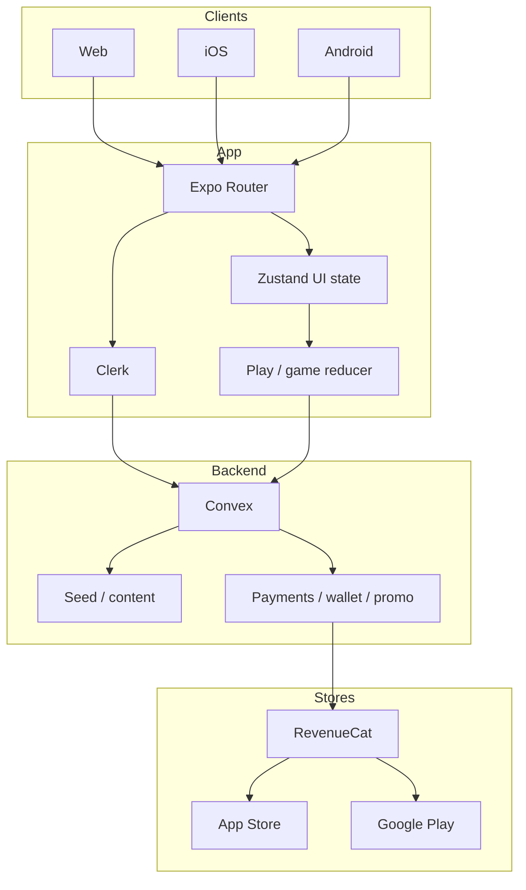

# Codebase Map — Backfire

> Cartographer refresh. Last mapped: 2026-10-06

## System Overview

Backfire is a competitive multiplayer trivia product at [playbackfire.com](https://playbackfire.com). Stack: **Expo SDK 55** / React Native / React 19, **Expo Router**, **Clerk**, **Convex**, **Zustand**, **RevenueCat** (native IAP + web Stripe billing), TypeScript throughout.


```mermaid
graph TB
  subgraph Clients
    Web[Web]
    iOS[iOS]
    Android[Android]
  end
  subgraph App
    Router[Expo Router]
    Auth[Clerk]
    UI[Zustand UI state]
    Play[Play / game reducer]
  end
  subgraph Backend
    Convex[Convex]
    Seed[Seed / content]
    Pay[Payments / wallet / promo]
  end
  subgraph Stores
    ASC[App Store]
    GP[Google Play]
    RC[RevenueCat]
  end

  Web --> Router
  iOS --> Router
  Android --> Router
  Router --> Auth
  Auth --> Convex
  Router --> UI
  UI --> Play
  Play --> Convex
  Convex --> Seed
  Convex --> Pay
  Pay --> RC
  RC --> ASC
  RC --> GP
```

### Environments (high level)

| Layer | Dev | Production |
| --- | --- | --- |
| Clerk | `worthy-primate-45.clerk.accounts.dev` | `clerk.playbackfire.com` |
| Convex | `successful-wildcat-165` (team `baitul-hikmah`, project `doubledown`) | `energized-hummingbird-439` |
| Web host | Vercel preview | `playbackfire.com` / `admin.playbackfire.com` |
| Android release | local Gradle | `bun run build:android:prod` (needs local Android SDK) |

Account ownership for each service: [HANDOVER.md](./HANDOVER.md). Env names: [.env.example](../.env.example).

---

## Directory Guide

```
app/                 Expo Router screens
  (auth)/            Sign-in / sign-up / forgot-password
  (app)/             Signed-in product (home, settings, store, play/*, game)
  (admin)/           Authenticated admin shell (web)
  admin/             Public admin entry (sign-in) + parallel admin routes
  legal / SEO        terms, privacy, delete-account, how-to-play, +html
features/            Feature modules (play, lobby, gameplay, wallet, promo, auth, …)
convex/              Backend: schema, content, users, wallet, payments, promo, seed, http
store/               Zustand: auth, play, theme, locale, display, offline queue, persistence
components/          Shared UI
constants/           theme, site, questions, feature flags, translations packs
lib/                 Providers, Clerk OAuth, RevenueCat, i18n, legal copy, hooks
scripts/             Seed import/normalize/push, locale packs, picture topics, iOS prod build
docs/                Maps, brand, handover, Vercel, product plans
__tests__/           Jest (use `bun run test -- --runInBand …`; never `bun test`)
```

### App routes (product)

| Area | Path | Role |
| --- | --- | --- |
| Hub | `app/(app)/index.tsx` | Mode cards, tokens, resume |
| Play flow | `app/(app)/play/*` | mode → length → teams → categories → board → question → answer → end |
| Store | `app/(app)/store.tsx` | Token packs (native RC / web RC Billing) |
| Settings | `app/(app)/settings.tsx` | Account, theme, app + content languages |
| Admin | `app/admin/*` + `app/(admin)/*` | Promo codes, wallets, purchases, referrals, topics |

### Features

| Module | Purpose |
| --- | --- |
| `features/play` | Board, scaffolds, token costs, store bundles, canonical keys, translations |
| `features/lobby` | Create-game wizard steps, lifelines |
| `features/gameplay` | Game reducer / phase machine |
| `features/shared` | Shared game types |
| `features/wallet` / `promo` / `auth` / `settings` / `content` / `profile` | Domain UI + helpers |

### Convex modules

| File | Role |
| --- | --- |
| `schema.ts` | Tables: users, wallets, purchases, promo, sessions, devices, questions, … |
| `content.ts` | Categories, question pools, translation variants, reports |
| `users.ts` | Upsert on sign-in, account deletion (needs `CLERK_SECRET_KEY`) |
| `wallet.ts` / `payments.ts` / `promo.ts` | Economy + RevenueCat webhooks |
| `seed.ts` | Category/question/product seed + legacy key migration helpers |
| `auth.config.ts` | Clerk JWT issuer (`CLERK_JWT_ISSUER_DOMAIN`) |
| `http.ts` | HTTP routes (webhooks) |

### Content identity

- Stable question keys are **`q<UserID>`** from the spreadsheet (see `features/play/canonicalKey.ts`).
- Do not derive keys from board position; legacy position keys are retired via seed migrations.
- UI i18n: 12 app locales under `lib/i18n/messages`.
- Trivia content locales: English + up to **2** of **17** non-English content locales (`CONTENT_LOCALES` in `lib/i18n/config.ts`), loaded at play time via Convex `content.getQuestionTranslationVariants` (English always shown first).

---

## Key Workflows

### Auth

1. Clerk session (email / Google / Apple where enabled).
2. Client calls `users:upsertOnFirstSignIn`.
3. Convex uses `identity.subject` (Clerk user id) via `by_clerk_id`.
4. Android OAuth callback: `clerk://com.playbackfire.app.callback` → `app/+native-intent.tsx` → `sso-callback`.

### Start a game

1. Hub / `play/mode` → team setup → categories → board.
2. Question cards come from Convex content pools (and bundled English catalog).
3. Phase machine in play store / gameplay reducer; landscape on mobile game screens.
4. Optional resume via session persistence + offline queue.

### Purchases

1. Native: RevenueCat SDK (`lib/payments/revenueCat.ts`) with Test Store by default; production store only when `EXPO_PUBLIC_REVENUECAT_USE_PRODUCTION_STORE=1`.
2. Web: RevenueCat Web Billing / Stripe (`lib/payments/revenueCatWeb.ts`) via `EXPO_PUBLIC_REVENUECAT_WEB_API_KEY`.
3. Convex `payments` webhook + wallet ledger; admin promo discounts use RevenueCat API v2 secrets in Convex env.

### Seed / translations

1. CSV / packs → `scripts/import-questions-from-csv.ts`, `normalize-questions.ts`, `build-locale-packs.ts`.
2. Push: `bun run seed:push` (dev) / `seed:push:prod` (explicit prod).
3. Prefer binding Convex CLI to a named deployment so prod is never accidental.

### Release

- **Android:** local Gradle via `bun run build:android:prod` (requires Android SDK on the machine). No cloud EAS builds.
- **iOS:** `bun run build:ios:prod` then App Store Connect (`asc`).
- **Web:** `bun run build:web` / Vercel (`docs/vercel-web-deployment.md`).

---

## Known Risks / Gotchas

1. **Theme:** Prefer `constants/theme.ts` (+ brand guidelines); `constants/legacy.ts` is narrow/legacy.
2. **Auth required** for all game modes (no guest play). `EXPO_PUBLIC_DISABLE_AUTH` is local/preview only.
3. **Theme hydrate** must run before first paint (`store/theme`).
4. **Responsive play:** `flex: 1` / `minHeight: 0`, ScrollView when overflowing, density from `useWindowDimensions`.
5. **Forgot password** screen still not fully wired to Clerk.
6. **Admin** sign-in rate limiting and Clerk lockout are the real controls.
7. **Tests:** `bun run test -- --runInBand <file>` — never `bun test` (Bun runner breaks on RN flow types).
8. **Secrets:** never commit `.env*`; use Convex / Vercel dashboards for server secrets. See `.env.example` and [HANDOVER.md](./HANDOVER.md).

---

## Navigation for common tasks

| Task | Start here |
| --- | --- |
| New screen | `app/(app)/…` + parent `_layout.tsx` |
| New Convex function | `convex/*.ts` + generated API |
| Play UI / board | `features/play`, `app/(app)/play/` |
| Design tokens | `constants/theme.ts`, [BRAND_GUIDELINES.md](./BRAND_GUIDELINES.md) |
| Client fix queue | [CLIENT_FIX_REQUESTS.md](./CLIENT_FIX_REQUESTS.md) (Notion) |
| Service accounts | [HANDOVER.md](./HANDOVER.md) |
| Web deploy | [vercel-web-deployment.md](./vercel-web-deployment.md) |

---

## Commands

```bash
bun install
bun run start                 # Expo dev
bun run android | ios | web
bun run test -- --runInBand <file>
bun run typecheck
bun run build:android:prod    # local production AAB (needs Android SDK + .env.production)
bun run build:ios:prod        # local production IPA
bun run build:web             # static export → dist/ (Vercel)
# Convex: use Convex CLI against the intended deployment name (dev vs prod)
```
